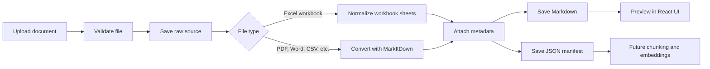

# Knowledge Hub Markdown Converter

Conversion-first MVP for building a governed Knowledge Hub ingestion pipeline.

The application lets a user upload documents such as Excel, PDF, Word, CSV, PowerPoint, text, JSON, HTML, XML, and ZIP files, converts them into Markdown, attaches document metadata, shows the Markdown output for review, and saves the raw file, Markdown file, and manifest locally.

This is the first step toward a full RAG knowledge base. Markdown is used as the human-reviewable and AI-friendly intermediate format. The final knowledge base should be built from chunk records derived from this Markdown, with metadata filters, citations, embeddings, and lifecycle rules.

---

## Run It In One Click

Double-click **`start.bat`** in this folder.

It checks for Python and Node.js and installs them if they are missing, creates the Python environment, installs every backend and frontend dependency, starts both servers, and opens the application in the browser at `http://127.0.0.1:5173`. The first run takes a few minutes because it downloads the dependencies; later runs take seconds. Pressing any key in that window shuts everything down again.

`HOW_TO_RUN.txt` says the same thing in non-technical terms. The manual, step-by-step alternative is in [Quick Start](#quick-start) below.

---

## Table of Contents

1. [What This System Does](#what-this-system-does)
2. [Current Status](#current-status)
3. [Capabilities & Limitations](#capabilities--limitations)
4. [Confidence Scoring](#confidence-scoring)
5. [AI Plugin (Azure OpenAI)](#ai-plugin-azure-openai)
6. [Tech Stack](#tech-stack)
7. [Prerequisites](#prerequisites)
8. [Quick Start](#quick-start)
9. [How to Run Day-to-Day](#how-to-run-day-to-day)
10. [Project Structure](#project-structure)
11. [Data Folders](#data-folders)
12. [End-to-End Flow](#end-to-end-flow)
13. [Conversion Strategy](#conversion-strategy)
14. [Metadata Model](#metadata-model)
15. [Knowledge Graph](#knowledge-graph)
16. [API Endpoints](#api-endpoints)
17. [Validation](#validation)
18. [Future RAG Architecture](#future-rag-architecture)
19. [Expired Document Strategy](#expired-document-strategy)
20. [Roadmap](#roadmap)

---

## What This System Does

A user uploads a document through a simple React UI. The backend:

1. Validates the upload.
2. Saves the raw source file locally.
3. Converts the file into Markdown.
4. Adds metadata for traceability, governance, and future retrieval.
5. Saves the Markdown output locally.
6. Saves a JSON manifest for the conversion.
7. Returns the Markdown to the UI for review.

Current user flow:

```text
Upload file -> Convert to Markdown -> Preview output -> Save locally -> Use later for chunking and embeddings
```

The important design principle is that the LLM should not be the knowledge store. The source documents and indexed chunks are the knowledge store. The LLM should only reason over retrieved, authorized, cited context.

---

## Current Status

This repository currently implements the conversion MVP.

| Area | Status | Notes |
|---|---|---|
| React upload UI | Done | Upload, drag and drop, metadata form, additional context, preview, copy, reset, download |
| Python backend | Done | FastAPI conversion API |
| Excel conversion | Done | Custom workbook extraction for cleaner Markdown |
| Generic file conversion | Done | Uses the Microsoft MarkItDown package (installed from `requirements.txt`) |
| Local file saving | Done | Raw upload, Markdown output, and manifest are saved locally |
| Metadata capture | Done | Document-level metadata is written into Markdown and manifest files |
| Confidence scoring | Done | Every conversion returns a confidence score (0-100) with breakdown |
| AI Plugin (Azure OpenAI) | Done | Optional image description and enhanced PDF extraction |
| AI cost tracking | Done | Pre-run estimate plus actual per-call token cost after every AI operation |
| Capabilities UI | Done | UI shows what the system can/cannot do and limitations encountered |
| Data cleaner | Done | Nine toggleable AI-readability transforms, non-destructive until saved |
| Batch conversion | Done | `batch_convert.py` converts a whole folder from the CLI, stamping shared governance metadata |
| Knowledge Assistant (RAG chat) | Done | Local BM25 retrieval over the converted Markdown + grounded Azure OpenAI answers with citations |
| Answer feedback | Done | Thumbs up/down and comments logged to `data/local/chat_feedback.jsonl` |
| Embeddings | Not yet | Retrieval is lexical (BM25); `AZURE_EMBEDDING_DEPLOYMENT` is configured but unused |
| Vector database / Azure AI Search | Not yet | Index is in-memory and rebuilt from disk on change |
| Authentication / Entra ID | Not yet | `access_group` and `classification` are recorded but not enforced |

---

## Capabilities & Limitations

### What This Converter CAN Do

| Feature | Details |
|---|---|
| Excel text & tables (.xlsx/.xls) | Extracts all sheets as Markdown tables with inferred headers, handles merged cells |
| PDF text extraction | Extracts text content and basic table structures from searchable PDFs |
| Word (.docx) conversion | Extracts text, headings, lists, and tables. Images referenced |
| PowerPoint (.pptx) conversion | Extracts slide text, tables, and chart titles/values |
| CSV / JSON / XML / HTML | High-fidelity text extraction for structured text formats |
| Image descriptions (AI Plugin) | Uses Azure OpenAI GPT to describe embedded images in documents |
| Scanned PDF / OCR (AI Plugin) | AI vision for text extraction from scanned/image-based PDFs |
| Confidence scoring | Every conversion returns a 0-100 confidence score with explanation |

### What This Converter CANNOT Do (Known Limitations)

| Limitation | Details | Mitigation |
|---|---|---|
| Excel embedded images | Images/shapes in Excel cells are silently dropped | Enable AI Plugin |
| Excel cell formatting | Currency, date formats, colors, conditional formatting lost | None - inherent to Markdown |
| Excel merged cells | Expanded but original visual layout context may be approximated | Review output |
| PDF complex tables | Multi-level headers or tables spanning pages may misalign | Use Azure Document Intelligence |
| PDF images/charts | Not extracted without AI plugin | Enable AI Plugin |
| Scanned/image-only PDFs | Empty output without AI plugin OCR | Enable AI Plugin |
| Document track changes | Word revision history and comments not preserved | None |
| Slide animations | PowerPoint transitions and exact slide layouts lost | None |
| Password-protected files | Cannot open or convert | Remove password first |
| Formula cells (no cache) | Excel formulas with no cached value appear blank | Open in Excel and save first |

---

## Confidence Scoring

Every conversion returns a confidence score broken down into four dimensions:

| Dimension | Weight | What It Measures |
|---|---|---|
| Structure Fidelity | 35% | Table/column alignment accuracy, merged cell handling |
| Content Completeness | 35% | Whether all data is present (no missing sheets, blank formula cells) |
| Image Handling | 15% | Whether embedded images were captured or silently dropped |
| Formatting Preservation | 15% | Whether formatting (dates, currency, layout) is represented |

**Score interpretation:**

| Score Range | Label | Meaning |
|---|---|---|
| 85-100 | High Confidence | Output is reliable for AI consumption |
| 65-84 | Medium Confidence | Output is usable but review specific flagged issues |
| 0-64 | Low Confidence | Output likely has significant gaps; manual review needed |

The score also returns:
- **Factors**: Explanations of what affected the score
- **Limitations hit**: Known limitations that were encountered during this conversion

---

## AI Plugin (Azure OpenAI)

The AI plugin uses Azure OpenAI GPT to enhance conversions with:
- **Image descriptions**: Embedded images in DOCX/PPTX/PDF are described by GPT
- **OCR-like extraction**: Scanned PDFs get vision-based text extraction
- **Better charts/diagrams**: Visual content is described in natural language

### Configuration

Copy `backend/.env.example` to `backend/.env` and fill in your own values:

```env
AZURE_OPENAI_ENDPOINT=https://your-resource.services.ai.azure.com
AZURE_OPENAI_API_KEY=your-api-key
AZURE_CHAT_DEPLOYMENT=gpt-4.1
AZURE_EMBEDDING_DEPLOYMENT=text-embedding-3-small
```

`.env` is git-ignored and must never be committed, shared, or included in a submission. If a key is ever exposed, rotate it in the Azure portal rather than relying on deletion.

All four settings are optional. Without them the converter still works; the AI plugin, the cleaner's AI summary, and the Knowledge Assistant's generated answer are the parts that switch themselves off (the assistant still retrieves and shows the relevant passages).

### Usage

Toggle "Enable AI Plugin" in the UI before converting. When enabled:
- Conversion may take longer (API calls to Azure OpenAI)
- Images in documents will be described
- Scanned PDFs will attempt OCR
- Confidence scores for image handling will improve

---

## Tech Stack

| Layer | Technology |
|---|---|
| Frontend | React, Vite, TypeScript, lucide-react |
| Backend | Python, FastAPI, Uvicorn |
| Excel parsing | openpyxl |
| Generic document conversion | MarkItDown (pip package) |
| PDF table recovery | pdfplumber |
| Retrieval | Pure-Python BM25 over heading-aware chunks (no external index) |
| AI Plugin | Azure OpenAI (GPT for image descriptions, optional) |
| Confidence scoring | Custom heuristic scorer (structure, content, images, formatting) |
| Local storage | `data/local/` folders |
| Future retrieval | Azure AI Search or vector database |
| Future embeddings | Azure OpenAI embeddings model |
| Future answer generation | Azure OpenAI GPT model or approved internal LLM |

---

## Prerequisites

- Windows PowerShell
- Python 3.11 or newer
- Node.js 18 or newer
- Access to the source document folders listed below
- (Optional) Azure OpenAI endpoint and API key for the AI plugin

---

## Quick Start

All commands below are relative to the repository root, so they work wherever you cloned it.

### 1. Install and Run the Backend

```powershell
cd backend
python -m venv venv
venv\Scripts\activate
pip install -r requirements.txt
copy .env.example .env    # then fill in your Azure OpenAI values (optional)
python run.py
```

Backend URLs:

| Service | URL |
|---|---|
| API | `http://127.0.0.1:8000` |
| Swagger docs | `http://127.0.0.1:8000/docs` |
| Health check | `http://127.0.0.1:8000/api/health` |

### 2. Build the Knowledge Base

Skip this if you are going to convert your own documents on the Documents tab —
the chat indexes whatever is in `data\local\markdown_outputs`. Run it to start
from the nine synthetic schedules the evaluation uses, and in either case
compile the graph once there are documents to compile it from:

```powershell
python backend\scripts\build_mock_corpus.py       # optional: the sample corpus
python backend\scripts\build_knowledge_graph.py   # required by the graph view and graph mode
```

`start.bat` does both for you on a fresh copy.

### 3. Install and Run the Frontend

Open a second terminal:

```powershell
cd frontend
npm install
npm run dev
```

Frontend URL:

```text
http://127.0.0.1:5173
```

---

## How to Run Day-to-Day

After dependencies are installed, start both apps:

```powershell
# Terminal 1
cd backend
venv\Scripts\activate
python run.py
```

```powershell
# Terminal 2
cd frontend
npm run dev
```

Then open:

```text
http://127.0.0.1:5173
```

---

## Project Structure

```text
markdown_converter/
├── backend/
│   ├── .env.example                   # Template — copy to .env (never committed)
│   ├── app/
│   │   ├── main.py                    # FastAPI app and API routes
│   │   ├── config.py                  # Local paths, upload limits, Azure config
│   │   ├── models.py                  # API request/response models
│   │   └── services/
│   │       ├── markdown_converter.py  # Conversion logic (Excel + MarkItDown)
│   │       ├── confidence_scorer.py   # Confidence scoring engine
│   │       ├── ai_plugin.py           # Azure OpenAI client, image/OCR, pricing
│   │       ├── file_analyzer.py       # Pre-conversion file analysis
│   │       ├── data_cleaner.py        # AI-readability cleaner (Clean Data tab)
│   │       ├── rag_service.py         # Chunking, BM25 retrieval, grounded answers
│   │       ├── graph_builder.py       # Extracts the knowledge graph from the corpus
│   │       ├── graph_store.py         # Loads the compiled graph and walks it
│   │       └── graph_rag.py           # Graph-expansion retrieval and re-ranking
│   ├── scripts/
│   │   ├── build_mock_corpus.py       # Builds the synthetic corpus via the converter
│   │   ├── mock_corpus_content.py     # The nine documents' text, read by the builder
│   │   └── build_knowledge_graph.py   # Compiles data/knowledge_graph.json
│   ├── tests/                         # Offline tests for the converter and retrieval
│   ├── batch_convert.py               # Convert a whole folder from the CLI
│   ├── requirements.txt
│   ├── pytest.ini
│   └── run.py
├── frontend/
│   ├── src/
│   │   ├── App.tsx                    # Shell: top bar and tab switching
│   │   ├── api.ts                     # API base URL, response types, fetch helpers
│   │   ├── pages/ChatPage.tsx         # Knowledge Assistant (RAG chat)
│   │   ├── pages/DocumentsPage.tsx    # Upload, preview, confidence, Clean Data tab
│   │   ├── pages/KnowledgeGraphView.tsx # Knowledge graph explorer and trace replay
│   │   ├── pages/GraphCanvas.tsx      # The graph renderer
│   │   ├── pages/knowledgeGraphModel.ts # Graph types, layout and filtering logic
│   │   └── styles.css
│   ├── package.json
│   └── vite.config.ts
├── data/
│   ├── knowledge_graph.json           # Compiled knowledge graph (see Knowledge Graph)
│   └── local/
│       ├── raw_uploads/               # Saved source files
│       ├── markdown_outputs/          # Saved Markdown files
│       ├── manifests/                 # Saved JSON manifests
│       └── chat_feedback.jsonl        # Answer feedback log
├── docs/                              # Architecture, services, API, data schema
├── start.bat                          # One-click setup and launch (Windows)
└── Readme.md
```

---

## Data Folders

Source documents are supplied by the user at upload time — the app does not read from any fixed source folder. It saves everything it generates here, relative to the repository root:

| Folder | Purpose |
|---|---|
| `data/local/raw_uploads/` | Local copy of uploaded raw files |
| `data/local/markdown_outputs/` | Converted Markdown files (plus `{id}.raw.md` backups after a clean-and-save) |
| `data/local/manifests/` | JSON metadata manifests |
| `data/local/chat_feedback.jsonl` | Thumbs up/down feedback from the Knowledge Assistant |

The knowledge base a reviewer runs against is *generated*, not hand-written: `backend/scripts/build_mock_corpus.py` produces nine synthetic policy documents and puts them through the real converter, so the corpus in these folders was made by the same code path as any upload. The build is deterministic — the same document ids and the same corpus fingerprint every time — and `start.bat` runs it automatically when the folders are empty. Everything you convert afterwards stays local and is git-ignored.

To convert a whole folder at once instead of using the UI:

```powershell
cd backend
python batch_convert.py --source ..\path\to\documents
python batch_convert.py --source ..\path\to\documents --no-ai   # skip Azure OpenAI, no cost
```

---

## End-to-End Flow



---

## Conversion Strategy

### Excel Files

Excel is handled with a custom converter because raw spreadsheet extraction often produces noisy output that is hard for an LLM to understand.

The converter currently:

- Trims empty leading and trailing rows and columns.
- Preserves workbook sheet names.
- Preserves source row and column ranges.
- Fills merged cells from their anchor value.
- Infers the most likely header row.
- Removes `NaN` and `Unnamed` artifacts.
- Emits Markdown tables.
- Warns when a sheet is hidden, very wide, very large, or appears to contain multiple table blocks.

Excel output includes sheet-level context such as:

```markdown
## Sheet: Mater Private

- Source rows: 1-120
- Source columns: 1-45
- Header row: 3

### Table
| Code | Plan | Cover |
| --- | --- | --- |
| 5071 | Essential Health 300 | Full cover |
```

### Other File Types

Other supported file types are routed through the MarkItDown package installed from `requirements.txt`.

Supported and intended file types include:

| Type | Examples | Notes |
|---|---|---|
| Excel | `.xlsx`, `.xlsm`, `.xls` | `.xlsx` and `.xlsm` use the custom Excel path; `.xls` uses MarkItDown |
| PDF | `.pdf` | Searchable PDFs work best; scanned PDFs should use OCR in a later phase |
| Word | `.doc`, `.docx` | Converted through MarkItDown |
| CSV | `.csv` | Converted to Markdown table |
| PowerPoint | `.pptx` | Converted through MarkItDown |
| Text / web formats | `.txt`, `.md`, `.html`, `.xml`, `.json` | Converted through MarkItDown |
| Archives / other | `.zip`, `.epub`, `.msg`, `.rtf` | Converted through MarkItDown where supported |

### Important PDF Note

For production, scanned PDFs and layout-heavy PDFs should be processed through Azure AI Document Intelligence or another OCR/layout extraction service. Markdown conversion alone is not enough when the source document is image-based or has complex visual layout.

---

## Metadata Model

Every converted Markdown file starts with metadata frontmatter. This metadata is critical for retrieval, citations, security trimming, expiry handling, and future vector indexing.

Example:

```yaml
document_id: "cardiac-list-jan-26-4b6458edcc3e"
document_title: "Cardiac list - Jan 26"
source_filename: "Cardiac list - Jan 26.xlsx"
source_type: "XLSX"
department: "Claims"
access_group: "KH_CLAIMS_USERS"
classification: "Internal"
document_owner: "Claims Ops"
additional_context: "Category: Cardiac benefit list. Missing columns are not supplied by the source workbook."
version: "v1.0"
expiry_review_date: "2026-12-01"
file_sha256: "..."
converted_at_utc: "2026-06-09T13:42:00+00:00"
extraction_strategy: "openpyxl workbook extraction with sheet-level Markdown tables"
```

If the source file does not clearly explain its category, meaning, missing columns, business rules, or sheet context, use the UI field called **Other category / description**. This value is saved as `additional_context` and is also written near the top of the Markdown under `Additional Context Provided by User`, so future chunking and embedding can preserve it.

Recommended document fields:

| Field | Purpose |
|---|---|
| `document_id` | Stable document identifier |
| `document_title` | Human-readable title and citation label |
| `source_filename` | Original uploaded file name |
| `source_type` | File type such as PDF, XLSX, DOCX, CSV |
| `source_path` | Saved raw source path |
| `markdown_path` | Saved Markdown path |
| `file_sha256` | Deduplication and change detection |
| `department` | Department filter, such as Claims or HR |
| `access_group` | Future Entra/security group filter |
| `classification` | General, Internal, Confidential, or Restricted |
| `document_owner` | Business owner responsible for content |
| `additional_context` | User-provided category, description, missing-field explanation, or business context |
| `version` | Version used in citations and freshness logic |
| `expiry_review_date` | Review or expiry date for lifecycle control |
| `converted_at_utc` | Conversion timestamp |

For the future vector index, each chunk should also include `chunk_id`, `content`, `sheet_name`, `page_number`, `row_start`, `row_end`, `section_heading`, `status`, `effective_date`, and `expiry_review_date`.

Detailed schema guidance is in [docs/ingestion-strategy.md](docs/ingestion-strategy.md).

---

## Knowledge Graph

The chat page retrieves *passages*. The knowledge graph is the structure those
passages sit in, and the same snapshot serves two purposes: it is the picture
you explore from **Documents → Explore knowledge graph**, and it is what the
`graph` retrieval mode walks. The picture and the retrieval are never two
different things.

**Shape.** Eight node types — document, section, chunk, concept, value,
constraint, community and facet — and eight relations: `contains`, `has_chunk`,
`follows`, `mentions`, `co_occurs`, `in_community`, `similar_to` and
`governed_by`. Nothing is hand-authored. Concepts are mined from the corpus by
C-value over 1–4 word phrases; amounts, rates, frequency limits, waiting periods
and age bounds are found by pattern; concept associations are NPMI over
co-occurrence; themes are deterministic label propagation; cross-document
similarity is cosine over TF-IDF vectors. The full method is recorded inside the
snapshot under `method`, so a graph can always explain how it was made.

**Two retrieval modes.** `POST /api/chat` takes a `mode`:

- `core` — BM25 over the chunks, nothing else;
- `graph` — the BM25 hits become seeds, the walk expands them over the graph,
  and the combined set is re-ranked. Every source in the response says whether
  it was a seed or an expansion, how many hops away it was, and which shared
  term brought it in. If no snapshot exists, the mode falls back to `core` and
  says so in `retrieval.fell_back` rather than failing the question.

**Build it before the first run.** The graph is compiled to a file rather than
rebuilt per request, because a snapshot is a citable artefact: the counts quoted
in the write-up and the retrieval traces behind the evaluation all refer to one
file with one fingerprint. `start.bat` builds the sample corpus and compiles the
graph automatically when neither exists yet. By hand:

```powershell
python backend\scripts\build_mock_corpus.py       # 9 synthetic documents, via the real converter
python backend\scripts\build_knowledge_graph.py   # compiles data\knowledge_graph.json
```

The corpus fingerprint is stored with the graph. After an upload the API marks
the snapshot `stale` and the graph view says so, rather than drawing a picture
of a corpus that has moved on — re-run `build_knowledge_graph.py` to catch up.

---

## API Endpoints

**Conversion**

| Method | Endpoint | Purpose |
|---|---|---|
| `GET` | `/api/health` | Backend health check |
| `POST` | `/api/convert` | Upload and convert a document (with optional `enable_plugin=true`) |
| `POST` | `/api/analyze` | Pre-scan a file before conversion to recommend AI plugin usage |
| `POST` | `/api/clean` | Run AI-readability transforms over a previously converted document (Clean Data tab) |
| `POST` | `/api/clean/save` | Promote a cleaned Markdown to canonical and update the manifest |
| `GET` | `/api/outputs/{filename}` | Download a saved Markdown output |
| `GET` | `/api/capabilities` | Returns what the system can/cannot do, limitations, and plugin status |
| `GET` | `/api/pricing` | Active deployment name and token pricing, for the UI cost estimates |

**Knowledge Assistant (RAG chat)**

| Method | Endpoint | Purpose |
|---|---|---|
| `POST` | `/api/chat` | Answer a question using only the converted Markdown corpus (`mode`: `core` or `graph`) |
| `GET` | `/api/knowledge/overview` | Corpus stats, indexed documents, and starter prompts |
| `GET` | `/api/knowledge/documents/{document_id}` | Full Markdown for one indexed document |
| `POST` | `/api/chat/feedback` | Record a thumbs up/down (and optional comment) on an answer |

**Knowledge graph**

| Method | Endpoint | Purpose |
|---|---|---|
| `GET` | `/api/graph/knowledge` | The compiled knowledge graph, plus a `stale` flag when the corpus has moved on since it was built |

Example upload request with PowerShell:

```powershell
curl.exe -X POST "http://127.0.0.1:8000/api/convert" `
  -F "file=@.\Cardiac list - Jan 26.xlsx" `
  -F "department=Claims" `
  -F "access_group=KH_CLAIMS_USERS" `
  -F "additional_context=Category: Cardiac benefit list. Missing columns are not supplied by the source workbook." `
  -F "classification=Internal" `
  -F "enable_plugin=true"
```

The response contains:

```json
{
  "markdown": "...",
  "metadata": {
    "document_id": "cardiac-list-jan-26-4b6458edcc3e",
    "sheet_count": 6
  },
  "output_file": "data/local/markdown_outputs/...md",
  "manifest_file": "data/local/manifests/...json",
  "warnings": [],
  "confidence": {
    "overall": 78.5,
    "structure_fidelity": 85.0,
    "content_completeness": 90.0,
    "image_handling": 0.0,
    "formatting_preservation": 70.0,
    "factors": ["Merged cells detected: structure may be approximated"],
    "limitations_hit": ["Excel contains embedded images that are NOT extracted"]
  },
  "plugin_used": false,
  "plugin_name": null
}
```

---

## Validation

Backend tests (55 tests, all offline — no Azure OpenAI calls):

```powershell
cd backend
pip install -r requirements.txt
python -m pytest
```

Backend syntax check:

```powershell
python -m compileall -q backend
```

Frontend type-check and build:

```powershell
cd frontend
npm run build
```

Manual validation checklist:

1. Start backend and frontend (or just run `start.bat`).
2. Open `http://127.0.0.1:5173`.
3. Upload any Excel workbook, PDF or Word file on the Documents tab.
4. Confirm the preview shows Markdown.
5. Confirm there are no `NaN` or `Unnamed` artifacts.
6. Confirm the Markdown file is saved in `data/local/markdown_outputs/`.
7. Confirm the manifest is saved in `data/local/manifests/`.
8. Ask a question on the Chat tab in both `core` and `graph` mode, and confirm
   every answer carries sources.
9. Open **Documents → Explore knowledge graph** and confirm the graph draws and
   is not flagged stale (re-run `build_knowledge_graph.py` if it is).

---

## Future RAG Architecture

The future production Knowledge Hub should follow this architecture:

```text
User question
  -> authenticate user and resolve groups
  -> retrieve authorized chunks from Azure AI Search or vector DB
  -> send only relevant context to the LLM
  -> return grounded answer with citations
```

Recommended Azure components:

| Layer | Azure Component | Purpose |
|---|---|---|
| Frontend | Azure Static Web Apps or Azure App Service | Host the UI |
| Authentication | Microsoft Entra ID | Login and group-based access |
| Backend | Azure App Service or Azure Functions | RAG orchestration and authorization |
| File storage | Azure Blob Storage, Data Lake, or SharePoint connector | Store approved source documents |
| Extraction | Azure AI Document Intelligence and conversion pipeline | Extract text, tables, OCR, layout |
| Retrieval | Azure AI Search | Hybrid search, vector search, metadata filters |
| Embeddings | Azure OpenAI embeddings | Convert chunks into vectors |
| LLM | Azure OpenAI GPT or approved internal LLM | Generate grounded answers |
| Monitoring | Azure Monitor and Application Insights | Logs, latency, failures, telemetry |
| Evaluation | Langfuse or Azure AI evaluation | Prompt traces, quality checks, feedback |

Recommended retrieval strategy:

1. Use hybrid search: keyword plus vector.
2. Use metadata filters before the LLM call.
3. Filter by department, access group, classification, document status, and expiry date.
4. Use semantic reranking where available.
5. Boost exact matches for procedure codes, plan names, document titles, sheet names, and dates.
6. Return citations using document title, page number, sheet name, row range, or section heading.

---

## Expired Document Strategy

Expired documents should be handled in both retrieval and indexing.

| Layer | Recommended action |
|---|---|
| Metadata | Store `status`, `effective_date`, `expiry_review_date`, `version`, and `supersedes_document_id` |
| Query time | Always filter out expired, deprecated, draft, and unauthorized chunks |
| Scheduled cleanup | Run a nightly job to mark expired chunks inactive or delete them from the index |
| Source storage | Use Azure Blob soft delete or custom metadata deletion detection where applicable |
| Audit | Keep manifest history after index chunks are removed |

Recommended rule:

```text
Do not rely on the prompt to ignore expired content. Remove or filter expired content before context is sent to the LLM.
```

---

## Roadmap

### Phase 1: Conversion MVP

Status: mostly complete.

- React upload UI
- FastAPI upload API
- Excel to Markdown conversion
- Generic document conversion through MarkItDown
- Metadata frontmatter
- Local raw, Markdown, and manifest saving
- Manual conversion verification

### Phase 2: Chunking and Embeddings

Next recommended work:

- Split Markdown into retrieval chunks.
- Create deterministic `chunk_id` values.
- Preserve sheet/page/row/section citations.
- Generate embeddings with Azure OpenAI.
- Store chunks in Azure AI Search or a vector database.
- Add incremental ingestion based on `file_sha256`.

### Phase 3: RAG Query API

Status: implemented locally (`/api/chat`), pending a managed index.

- ✅ `/api/chat` endpoint returning a structured, call-ready answer.
- ✅ Answers restricted to retrieved passages, with citations and a confidence
  indicator capped by what retrieval actually supports.
- ✅ Fallback behaviour when nothing relevant is found — the model is never called.
- ⬜ Hybrid (dense + sparse) search instead of BM25 alone.
- ⬜ Metadata filters applied before results reach the LLM.

### Phase 4: Enterprise Governance

- Microsoft Entra ID authentication.
- Group-based authorization.
- Admin upload and approval workflow.
- Document lifecycle and expiry jobs.
- Evaluation set with golden questions.
- Observability dashboards for retrieval quality, latency, cost, and no-answer rate.

---

## Final Design Position

This approach is sound: use Markdown as the reviewable conversion layer, then use structured chunks for retrieval.

The success of the full Knowledge Hub will depend less on the LLM and more on:

- Clean conversion.
- Reliable metadata.
- Good chunking.
- Strict access filters.
- Freshness and expiry rules.
- Hybrid retrieval.
- Clear citations.

The current application correctly focuses on the first hard problem: converting messy business documents into clean, inspectable Markdown that can later become trustworthy retrieval context.